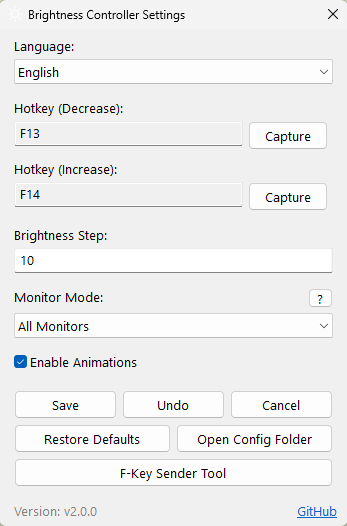
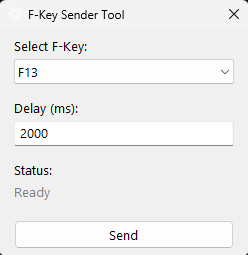

#  Brightness Controller for Desktop

Control your external monitor's brightness using keyboard shortcuts with a Windows 11-style OSD.

## Features

- DDC/CI brightness control for external monitors
- Windows 11 style animated OSD popup
- Quick brightness popup on tray double-click
- Multi-monitor support (all / cursor position / specific monitor)
- Multi-key hotkey support (Ctrl+Alt+Key combinations)
- Customizable hotkeys via Settings GUI
- F-Key Sender Tool for keyboard macro integration
- Multi-language: English, Türkçe, Русский, 中文, 日本語
- System tray integration

## Requirements

- Windows 10/11
- External monitor with DDC/CI support
- AutoHotkey v2.0 (only for .ahk version)

## Installation

### Using Setup
1. Run `setup.exe` or `setup.ahk` (requires AutoHotkey) as administrator
2. Choose installation type (AHK or EXE)
3. Choose whether to add to Windows startup

For easy installation and maximum compatibility, use the EXE version. If you want to customize, you can delete the included `brightness_control.exe` and compile `brightness_control.ahk` yourself to create your own EXE.

### Manual
1. Copy files to your preferred location
2. Run `brightness_control.exe` (or run `.ahk` with AutoHotkey)

## Quick Brightness Popup

Double-click the application icon in the system tray to open a quick brightness slider:

- Drag to adjust brightness
- Scroll anywhere to fine-tune
- Click outside to close

## System Tray Menu

Right-click the application icon in the system tray to access the menu:

- Settings - Opens settings window
- Reload Config - Applies config.ini settings to the program
- Exit - Closes the application

**Tip:** You can disable the OSD notification popup in Settings under "Enable OSD Popup".

## Hotkey Configuration

Right-click the application icon in the system tray and select Settings to configure hotkeys:

1. Click the Capture button next to any hotkey field
2. Press your desired combination keys
3. Click Save to apply and restart

Multi-key examples: `Win+Ctrl+Up`, `Alt+F13`, `Ctrl+Shift+PageUp`

## Manual Config Editing

If you want, you can manually edit the `config.ini` file:

1. Right-click tray icon → Open Config Folder (in Settings)
2. Edit `config.ini` with a text editor
3. Right-click tray icon → Reload Config to apply changes

Note: If you cannot edit the config file in the C:\ folder, copy it to your desktop, make changes there, save, and move it back to the original directory.

### Hotkey Symbols

When editing hotkeys in config.ini, use these symbols:

| Key | Symbol |
|-----|--------|
| Ctrl | `^` |
| Alt | `!` |
| Shift | `+` |
| Win | `#` |

Example: `^!Up` = Ctrl+Alt+Up, `#+Down` = Win+Shift+Down

## F-Key Sender Tool

This utility helps you assign virtual F13-F24 keys as brightness hotkeys when using keyboard macro software (like Logi Options+, Razer Synapse, etc.).

How it works:
1. Configure your keyboard software to send F13-F24 on a button
2. Open Settings → F-Key Sender Tool
3. Click Capture in Settings for the hotkey you want to assign
4. Use F-Key Sender to send the key so you can capture it
5. The virtual key is now assigned as your brightness hotkey

## Creating Your Own EXE

If you want to customize the script and create your own compiled version:

1. Delete the existing `brightness_control.exe` file
2. Install [AutoHotkey v2.0](https://www.autohotkey.com/)
3. Make your modifications to `brightness_control.ahk`
4. Right-click the .ahk file → Compile Script
5. Select your .ahk file as source
6. Optionally set a custom icon (.ico file)
7. Click Convert

## High Priority Startup

Setup offers three startup options:
- **No startup** - Manual launch only
- **Normal startup** - Startup folder shortcut (standard)
- **High priority startup** - Task Scheduler (starts before other apps)

### Manual Startup Configuration

You can also configure startup manually using PowerShell scripts (run as Administrator):

| Script | Description |
|--------|-------------|
| `install_startup_task.ps1` | Enable high priority startup |
| `make_normal_startup.ps1` | Switch to normal startup |
| `uninstall_startup_task.ps1` | Disable startup completely |

Run in PowerShell to check status: `schtasks /Query /TN "BrightnessController"`

## Uninstall

Run `uninstall.exe` or `uninstall.ahk` to completely remove the following:
- Scheduled task
- Startup shortcut
- Installation folder

## Files

| File | Description |
|------|-------------|
| `brightness_control.exe` | Main application (compiled) |
| `brightness_control.ahk` | Main application (source) |
| `setup.exe` | Installer |
| `setup.ahk` | Installer script (source) |
| `uninstall.ahk` | Uninstaller script |
| `config.ini` | Configuration (auto-generated) |

## Troubleshooting

Monitor not detected?
- Enable DDC/CI in your monitor's OSD menu
- Reconnect monitor cable

Hotkeys not working?
- Check for conflicting applications
- Run as administrator

## License

MIT License

## Credits

Developed by [@atakansariyar](https://github.com/atakansariyar)

